# Week 3

这周继续学习亿点css

## CSS浮动

什么是浮动？浮动就是让盒子漂浮起来，而不占有原来的位置，看下面这个例子。

```html

<body>
	<!-- 无浮动  -->
  <div class="container">
    <div class="A"></div>
    <div class="B"></div>
  </div>
    <!-- 有浮动  -->
  <div class="container">
    <div class="A float"></div>
    <div class="B"></div>
  </div>
    
</body>

<style>
  .container {
    display: inline-block;
  }
  .A {
    height: 100px;
    width: 100px;
    background-color: pink;
  }
  .B {
    height: 200px;
    width: 200px;
    background-color: aqua;
  }
  .float {
    float: left;
  }
</style>

```

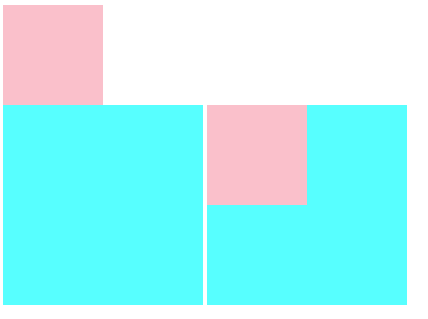

### 传统网页布局三种方式

- 普通流（标准流）
- 浮动
- 定位

**多个块级元素纵向排列用标准流，横向排列用浮动**

### 标准流

标签按照规定好默认方式排列

1. 块级元素独占一行，从上向下排列
2. 行内元素从左向右排列

### 浮动

```css
float: none/left/right
```

#### 浮动特性

**浮动元素不会压住标准流的文字!!!**(但会压住盒子)

##### 脱标（脱离标准流）

1. 脱离标准流的控制（浮）移动到指定位置（动）
2. 浮动的盒子不再保留原先的位置

##### 浮动元素一行显示

上沿对齐

##### 浮动元素具有行内块元素特性

##### 浮动盒子只影响后面的标准流

#### 清除浮动

为什么要清除浮动？**清除浮动主要是为了解决，父元素因为子级元素浮动引起的内部高度为0的问题**

当父元素不给高度的时候，

内部元素不浮动时会撑开

而浮动的时候，父元素变成一条线

```css
选择器{clear:both;}
```

##### 额外标签法（隔墙法）

在最后一个浮动元素后加一个标签（必须是块内元素），调用clear

父级添加overflow

```css
overflow: hidden | scroll | auto
```

##### after伪元素法

给父级添加clearfix

```css
.clearfix:after {
	content: "";
    display: block;
    height: 0;
    clear: both;
    visibility: hidden;
}
.clearfix {
	*zoom: 1;
}
```

##### 双伪元素法

```css
.clearfix:before,.clearfix:after {
	content: "";
    display: table;
}
.clear:after {
    clear:both;
}
.clearfix {
	*zoom: 1;
}
```

## 定位

定位可以让盒子自由的在某个盒子内移动位置或者固定在屏幕中的某个位置

定位 = 定位模式 + 边偏移

### 定位模式

定位模式决定元素的定位方式，它通过CSS的position属性来设置

| 值       | 语义     |
| -------- | -------- |
| static   | 静态定位 |
| relative | 相对定位 |
| absolute | 绝对定位 |
| fixed    | 固定定位 |

### 边偏移

如果有left和right，执行left；有top和bottom，执行top

| 属性   | 实例         | 描述                                                   |
| ------ | ------------ | ------------------------------------------------------ |
| top    | top：80px    | **顶端偏移量**，定义元素相对于其父元素**上边线**的距离 |
| bottom | bottom: 80px | **底端偏移量**，定义元素相对于其父元素**下边线**的距离 |
| left   | left: 80px   | **左端偏移量**，定义元素相对于其父元素**左边线**的距离 |
| right  | right: 80px  | **右端偏移量**，定义元素相对于其父元素**右边线**的距离 |

### 静态定位 static

静态定位是元素的**默认定位方式，无定位的意思**

```
选择器 {position: static;}
```

无边偏移，按标准流特性摆放位置

### 相对定位 relative

相对定位是元素在移动位置的时候，是相对它原来的位置来说的

即上边界为原来坐标位置的上边界

```
选择器 {positon: static}
```

**原位置保留，下面盒子不会占据其位置，以标准流对待（不脱标）**典型应用：给绝对定位当爹

### 绝对定位 absolute

绝对定位是元素在移动位置的时候，是相对其父元素来说

```
选择器 {position: absolute;}
```

特点：

1. 如果没有**父元素或者父元素没有定位**，则以浏览器为准定位
2. 如果父元素有定位，则以最近一级有定位的父元素位置为准
3. 绝对定位脱离标准流

### 固定定位 fixed

```
选择器 {position: fixed;}
```

1. 以浏览器的可视窗口为基准
2. 和父元素无关系
3. 不随窗口滚动而滚动
4. 不占有原位置

#### 固定在版心右侧

- left: %50
- margin-left: length/2;

### 粘性定位 sticky

在达到固定定位的位置时，变为固定定位

**兼容性差，仅供了解**

```
选择器 {position: sticky;}
```

1. 以浏览器的可视窗口为基准
2. 占有原先位置
3. 必须添加一个边偏移

### 定位叠放顺序 z-index

```
z-index: 2;
```

默认为auto，可以为正负整数，0，数值越大，盒子在越上方

若数值相同，自下而上按书写顺序

### 定位的特殊属性

- 添加绝对或固定定位后，可直接设置高度和宽度
- 块级元素添加绝对或固定定位后，若不给宽度或高度，默认内容大小
- 脱标盒子不会触发外边距塌陷
- **绝对或固定定位会完全压住标准流文字，而浮动不会**

## 元素的显示与隐藏

### display

隐藏元素后，不再占有原先位置

```css
display: none;隐藏对象
display: block;转换为块级元素或者显示对象
```

### visibility

隐藏元素后，继续占有原来的位置

```css
visibility: hidden;隐藏
visibility: visible;可视
```

```html
<body>

  <div class="inline-block">
    <div class="C"></div>
    <div class="A"></div>
  </div>

  <div class="inline-block">
    <div class="C"></div>
    <div class="B"></div>
  </div>
    
</body>

<style>
  .inline-block {
    display: inline-block;
  }
  .A {
    display: none;
    height: 100px;
    width: 100px;
    background-color: pink;
  }
  .B {
    visibility: hidden;
    height: 100px;
    width: 100px;
    background-color: pink;
  }
  .C {
    height: 100px;
    width: 100px;
    background-color: greenyellow;
  }

</style>
```

可以发现使用display隐藏后，绿格子塌了下来，而visibility的方式无任何变化

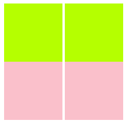

### 

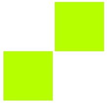

隐藏溢出元素

```css
overflow: hidden;
overflow: visible;
overflow: scroll;滚动条
overflow: auto;超出有滚动条，不超出无滚动条
```

如果有定位的盒子，慎用overflow:hidden,会隐藏多余部分

## 字体图标

### 字体图标下载

有些常用字体图表网站，大家尝试下

- icomoon
- iconfont

### 字体图标使用

文件夹名为fonts

```css
 <style>
    /* 字体声明 */
     @font-face {
  font-family: 'icomoon';
  src:  url('fonts/icomoon.eot?p4ssmb');
  src:  url('fonts/icomoon.eot?p4ssmb#iefix') format('embedded-opentype'),
    url('fonts/icomoon.ttf?p4ssmb') format('truetype'),
    url('fonts/icomoon.woff?p4ssmb') format('woff'),
    url('fonts/icomoon.svg?p4ssmb#icomoon') format('svg');
  font-weight: normal;
  font-style: normal;
  font-display: block;
}

  span {
    font-family: 'icomoon';
    font-size: 100px;
    color:pink;
  }
  </style>
```


## CSS三角

```css
.box1 {
    height: 0;
    width: 0;
    border: 100px solid transparent;
    border-top-color: red;
}
```

## 

## CSS用户界面样式

### 鼠标样式 cursor

```css
li {cursor: pointer; }
```

| 属性值      | 描述      |
| ----------- | --------- |
| default     | 小白 默认 |
| pointer     | 小手      |
| move        | 移动      |
| text        | 文本      |
| not-allowed | 禁止      |

### 轮廓线 outline

```css
input {outline: none;}
```

### 防止拖拽文本域 resize

```css
textarea{resize: none;}
```

### vertical-align

对于行内元素和行内块元素有效

#### 实现图片表单等与文字垂直居中对齐

```css
vertical-align : baseline | top | middle | bottom
```

| Value    | Description                            |
| -------- | -------------------------------------- |
| baseline | 默认。元素放置在父元素的基线上         |
| top      | 把元素的顶端与行中最高元素的顶端对齐   |
| middle   | 把此元素放置在父元素的中部             |
| bottom   | 把元素的顶端与行中最低的元素的顶端对齐 |

#### 解决图片底侧默认空白缝隙

1. vertical-align: middle | top | bottom等
2. 将图片display: block


## CSS3

### 属性选择器

属性选择器可不借助于类和id完成选择

```css
<style>
	input[value] {
    	
	}
</style>
<input type="text" value = "请输入用户名"></input>
```

可以选择属性=值的某些元素

```css
<style>
	input[type=text] {
    	
	}
</style>
<input type="text" value = "请输入用户名"></input>
<input type="password" name = "" id =""></input>
```

可以选择属性值开头为val的某些元素

```css
<style>
	div[class^=icon] {
    	
	}
</style>
<div class="icon1"></div>
<div class="icon2"></div>
<div class="icon3"></div>
```

可以选择属性值结尾为val的某些元素

```css
div[class$=val] {

}
```

可以选择属性值含有val的某些元素

```css
div[class*=val]{

}
```

类选择器、属性选择器、伪类选择器权重都是10

### 结构伪类选择器

```css
ul li:first-child
ul li:first-of-type

ul :last-child
ul li:last-of-type

n可以为数字、公式、关键字
ul div:nth-child(n) //对所有东西编号,再看是不是div
ul div:nth-of-type()//先对所有div编号,再看第几个孩子
关键字： even偶数 odd奇数

ul li:nth-child(odd){
    background-color: gray;
}
ul li:nth-child(2n+1){n从0开始自增
    background-color: gray;
}
```

### 伪元素选择器

利用css创建标签元素而不需要html，从而简化html结构

| 选择符   | Description              |
| -------- | ------------------------ |
| ::before | 在元素内部的前面插入内容 |
| ::after  | 在元素内部的后面插入内容 |

注意：

- before和after创建一个元素，但是属于**行内元素**
- 新创建的这个元素在文档树中是找不到的，所以称为伪元素
- 语法：element::before{}
- before和after必须有content属性
- before在父元素内容前面创建元素，after则在后面
- 权重为1

```
div::before{
	content: '';
}
```

### box-sizing

```
box-sizing: content-box 盒子大小为width + padding + border默认
box-sizing: border-box 盒子大小为width
```

### 图片模糊处理 滤镜filter

```
filter: 函数(); 例如 filter:blur(5px)
```

### calc函数

```
width: calu(100%-80%);
```

### 2D转换

转换综合写法：

- 顺序影响功能，位移写最前面

- ```css
  transform: translate() rotate()
  ```

  

#### 位移transform

单位px

- **不会影响其他元素的位置！！！**
- 百分比单位相对于自身元素
- 对行内标签无效果

```css
transform: translate(x,y);
transform: translateX(x);
transform: translateY(y);
```

#### 旋转rotate

单位deg

```css
transform: rotate(xdeg);
transform-origin: x y;设置旋转中心点
transform-origin: left bottom;可设置像素，百分比，方位名词
```

#### 缩放scale

无单位，大于1放大，小于1缩小

- **不会影响其他盒子，可设置中心点**

```css
transform: scale(x,y);w缩放x倍, h缩放y倍
transform: scale(x);等比例缩放x倍
```


### 过渡

**谁做过渡给谁加**

```
transition:要过渡的属性 花费时间 运动曲线 何时开始；
transition: weight .5s, height .5s;
transition: all .5s;
```

**1.属性**： 想要变化的css属性，宽度高度 背景颜色 内外边距都可。如果想要所有的属性都变化过渡，写一个all就可以。

**2.花费时间**：单位是 秒（必须写单位）比如0.5s

**3.运动曲线**：默认是ease（可以省略）

**4.何时开始**：单位是 秒（必须写单位）可以设置延迟出发时间 默认是0s（可以省略）


一个栗子

<video src="./Week 3.assets/transition.mp4"></video>

### 动画

1. keyframe定义

2. 调用动画

   ```css
   @keyframes 动画名称 {
    	/*开始状态*/   
       /*from 和 to 等价于 0% 和 100%*/
   	0% {
   		width: 100px;
   	}
       /*结束状态*/
   	100% {
   		width: 100px
   	}
   }
   
   div {
   	animation-name: 动画名称;
       animation-duration: 持续时间;单位s
   }
   ```

#### 常用属性

| 属性                      | 描述                                                   |
| ------------------------- | ------------------------------------------------------ |
| @keyframes                | 规定动画                                               |
| animation                 | 除play-state所有属性简写                               |
| animation-name            | 动画名称                                               |
| animation-duration        | 动画时间                                               |
| animation-timing-function | 动画速度曲线，默认"ease"                               |
| animation-delay           | 动画开始时间，默认0                                    |
| animation-iteration-count | 动画播放次数，默认1，有infinite                        |
| animation-direction       | 动画是否在下周期逆向播放，默认"normal",alternate逆播放 |
| animation-play-state      | 动画是否正在运行，默认"running",还有pause              |
| animation-fill-mode       | 动画结束后状态，保持forwards回到起始backwards          |

<video src="./Week 3.assets/anime.mp4"></video>

```html
<!DOCTYPE html>
<html lang="en">
<head>
  <meta charset="UTF-8">
  <meta http-equiv="X-UA-Compatible" content="IE=edge">
  <meta name="viewport" content="width=device-width, initial-scale=1.0">
  <title>Document</title>
</head>
<body>

  <div class="box1"></div>
  <div class="box2"></div>
  <div class="box3"></div>
  <div class="box4"></div>
  <div class="box5"></div>

</body>

<style>
@keyframes test {
  0% {
    transform: rotate(0deg);
    transform-origin: 100px 100px;
  }
  20% {
    transform: rotate(72deg);
    transform-origin: 100px 100px;
  }
  40% {
    transform: rotate(144deg);
    transform-origin: 100px 100px;
  }
  60% {
    transform: rotate(216deg);
    transform-origin: 100px 100px;
  }
  80% {
    transform: rotate(288deg);
    transform-origin: 100px 100px;
  }
  100% {
    transform: rotate(360deg);
    transform-origin: 100px 100px;
  }
}

  .box1 {
    position: absolute;
    top: 50%;
    left: 50%;
    height: 50px;
    width: 50px;
    border-radius: 100%;
    background-color: greenyellow;
    animation: test 5s infinite ;
  }
  .box2 {
    position: absolute;
    top: 50%;
    left: 50%;
    height: 50px;
    width: 50px;
    border-radius: 100%;
    background-color: rgb(47, 255, 189);
    animation: test 5s 1s infinite ;
  }
  .box3 {
    position: absolute;
    top: 50%;
    left: 50%;
    height: 50px;
    width: 50px;
    border-radius: 100%;
    background-color: rgb(47, 252, 255);
    animation: test 5s 2s infinite ;

  }
  .box4 {
    position: absolute;
    top: 50%;
    left: 50%;
    height: 50px;
    width: 50px;
    border-radius: 100%;
    background-color: rgb(47, 120, 255);
    animation: test 5s 3s infinite ;
  }
  .box5 {
    position: absolute;
    top: 50%;
    left: 50%;
    height: 50px;
    width: 50px;
    border-radius: 100%;
    background-color: rgb(186, 47, 255);
    animation: test 5s 4s infinite ;
  }

</style>
</html>
```

#### 3D转换

3d的东西不是很常用？在这里只是稍微罗列一下，需要的时候查下文档吧）

#### 透视perspective

所谓透视，就是说元素近大远小，使呈现3d效果

```html
perspective：100px
```

**要给被观察元素的父元素添加透视**

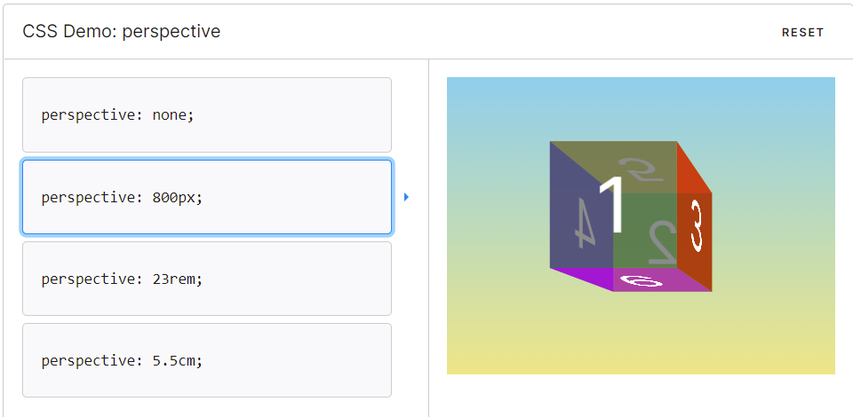

#### 位移transform

单位px

- **不会影响其他元素的位置！！！**
- 百分比单位相对于自身元素
- 对行内标签无效果

```css
transform: translate3d(x,y,z);
transform: translateX(x);
transform: translateY(y);
transform: translateZ(z);
```

#### 旋转rotate

单位deg

```css
transform: rotate3d(xdeg, ydeg,  zdeg);
transform: rotateX(xdeg);
transform: rotateY(ydeg);
transform: rotateZ(zdeg);
transform-origin: x y;设置旋转中心点
transform-origin: left bottom;可设置像素，百分比，方位名词
```

#### 3d呈现transform-style

**`transform-style `**设置元素的子元素是位于 3D 空间中还是平面中。

```html
transform-style:preserve-3d		开启3d呈现
```

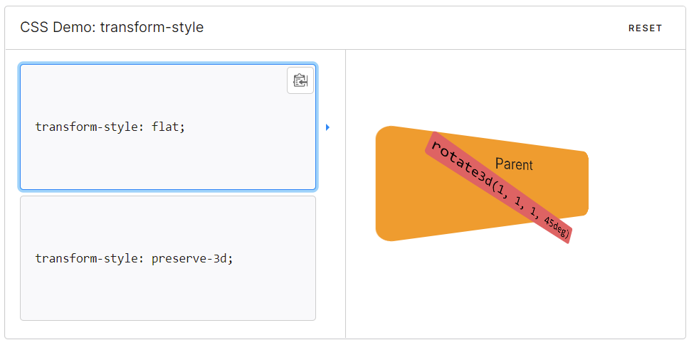

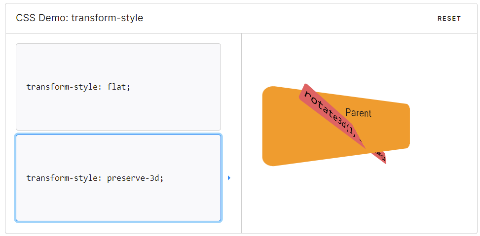

## flex布局

很重要的布局，大家要多练习一下

```css
display: flex
```

### flex-direction

设置主轴方向，默认主轴为x轴，为从左到右

| 属性值         | 描述         |
| -------------- | ------------ |
| row            | 默认从左到右 |
| row-reverse    | 从右到左     |
| column         | 从上到下     |
| column-reverse | 从下到上     |

##### row

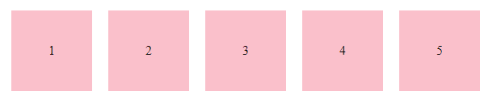

##### row-reverse

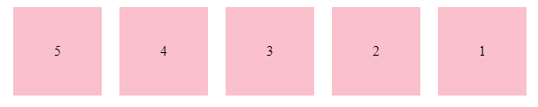

#### justify-content

设置 主轴子元素排列


| 属性值        | 描述                       |
| ------------- | -------------------------- |
| flex-start    | 默认从头部开始             |
| flex-end      | 从尾部开始                 |
| center        | 在主轴居中对齐             |
| space-around  | 平分剩余空间               |
| space-between | 先两边贴边，在平分剩余空间 |

##### 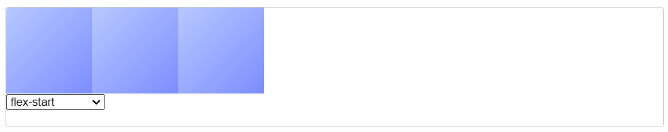

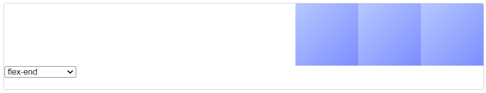

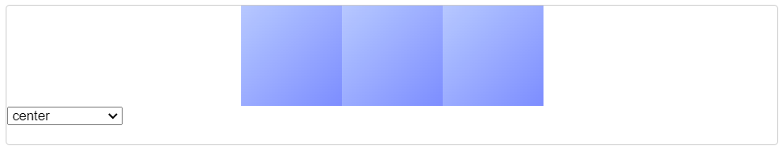

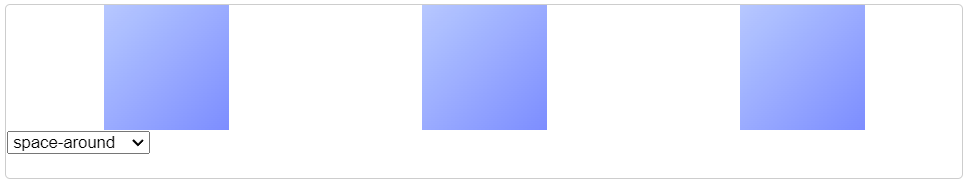

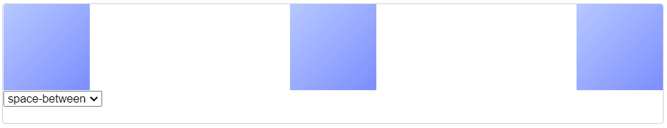

### flex-wrap

指定 flex 元素单行显示还是多行显示。如果允许换行，这个属性允许你控制行的堆叠方向。


| 属性值       | 描述               |
| ------------ | ------------------ |
| nowrap       | 不换行             |
| wrap         | 换行               |
| wrap-reverse | 换行，反向开始排列 |

```html
<body>

  <div class="box">
    <div class="A">1</div>
    <div class="A">2</div>
    <div class="A">3</div>
    <div class="A">4</div>
    <div class="A">5</div>
  </div>

</body>

<style>
.box {
  display: flex;
  flex-direction: row;
  flex-wrap: wrap-reverse;
  height: 300px;
  width: 500px;
  border: 5px solid black;
}
.A {
  height: 100px;
  width: 100px;
  background-color: pink;
  margin:10px;
  text-align: center;
  line-height: 100px;
}

</style>
```


#### nowrap

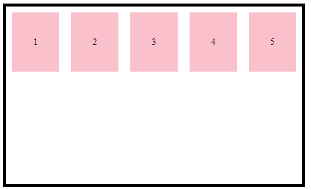

#### wrap

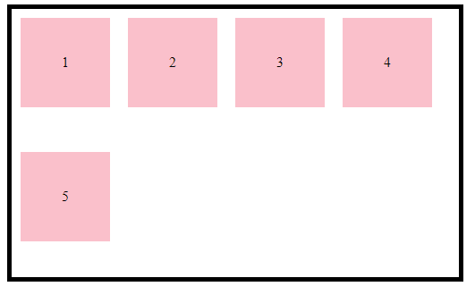

#### wrap-reverse

​			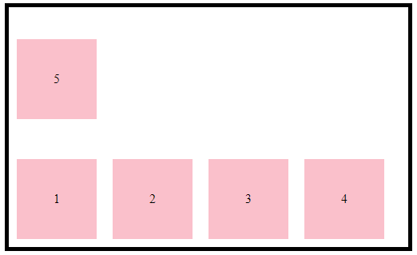

### align-items

设置侧轴上的子元素排列方式

| 属性值     | 描述           |
| ---------- | -------------- |
| flex-start | 从上到下       |
| flex-end   | 从下到上       |
| center     | 垂直居中       |
| stretch    | 拉伸（默认值） |

#### align-content

类似justify-content 设置侧轴子元素排列

| 属性值        | 描述                       |
| ------------- | -------------------------- |
| flex-start    | 默认从头部开始             |
| flex-end      | 从尾部开始                 |
| center        | 在主轴居中对齐             |
| space-around  | 平分剩余空间               |
| space-between | 先两边贴边，在平分剩余空间 |
| strech        | 平分父元素高度             |

### flex-flow

复合属性

```css
flex-flow: flex-direction flex-wrap;
```


## 后记

至此，css的主要内容就全部结束了，css的内容实在是太多了，两周的css也不可能全部讲到，在实际上手时还是要多多查阅文档。

下周会带来一次实践课，带着大家一步一步地写一个网页，大家也可以先自己试一试。

## 本周练习

**提交方式**： 邮箱 lxy.littlechai@qq.com or 私发给我

用本节课所学flex布局、浮动、过渡等知识再写一次b站首页排行榜，**效果应尽量同b站**（下图弹出详情不做要求）

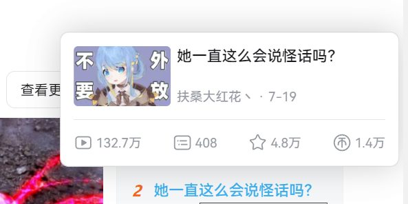

![image-20220711095137479](Week 3.assets/image-20220711095137479.png
