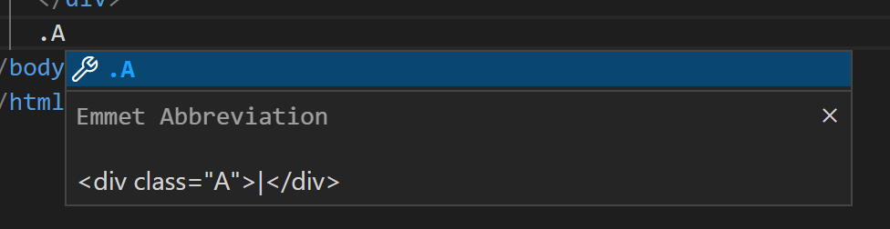
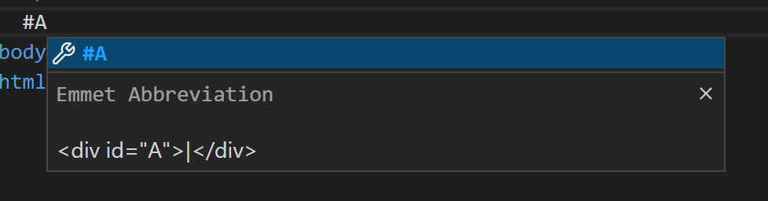
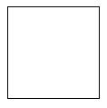
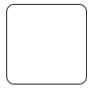
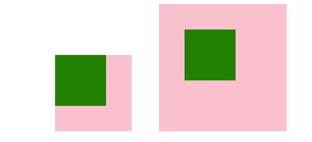
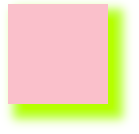
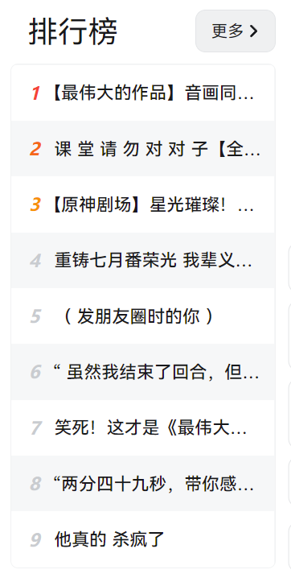

# CSS


## 说在前面

这周分享一下CSS的部分内容，css部分需要大家多写多练，很多坑只能在coding的时候发现。。。。

css的内容太多了。。。一个个截图有点麻烦，要不大家就一个个试一下吧（破涕为笑）

css相关可查找文档**MDN** https://developer.mozilla.org/zh-CN/


## 关于调试

<video src="Week2.assets/debug.mp4"></video>

## CSS的引入方式

### 内部样式表

理论上可放在任何地方，一般放在head内

```html
<style>
    div {
	color: red;
    }
</style>
```

### 行内样式表

```html
<div style="color: red; font-size=12px;">
```

### 外部样式表

将`.css`文件导入当前文件中

```html
<link rel="stylesheet" href="css文件路径">
```


## CSS基础选择器

怎样知道要修改哪一个html标签的样式呢？要通过css选择器来指定改变样式的元素。

### 标签选择器

改变所有选择标签的样式

```
 h1(标签名) {
            各种属性
			color: red;
            font-size: 12px;
        }
```

### 类选择器

在标签中可以用`class=“”`来指定要给该标签添加哪些样式

在css中，中 `.name`来声明名字为name的样式

在vscode里，可以使用`.name`的方式来快速打出代码



```html
.what(格式 . + 名字) {
	color: red;
}

<div class="what how"> orz </div>多个可用

```

class可加多类名，类名间要加空格

### id选择器

在标签中可以用`id=“”`来指定标签名字

在css中，中 `#name`来声明id为name的标签样式

**只能调用一次**

在vscode里，可以使用`#name`的方式来快速打出代码



```html
#id名{
	属性1：属性值
}
```

### 通配符选择器

对所有生效，通常用来修改全局样式

```html
*{
	属性1：
}
```

### 优先级

style属性 > id选择器 > class选择器 > 标签选择器

## CSS复合选择器

什么是符合选择器？考虑下面一段代码

```html
	<div class="A">
      <p></p>
    </div>
    <div class="B">
      <div class=“C”>
        <div>
          
        </div>
      </div>
    </div>
```

如果我们想只选中B里面的第一个div标签该怎么办呢？

### 后代选择器

类 元素1 元素2 元素n中间有空格，且为父子关系

```html
<div class="B">
      <div class="C"></div>
</div>

<style>
	.B C{
	
	}
</style>
```

### 子选择器

必须选择亲儿子元素

```html
<div class="B">
      <div class=“C”>  <!-- 选定这个C -->
        <div>
          
        </div>
      </div>
    </div>

<style>
	.B>div
</style>
```

### 并集选择器

```html
<style>
    (约定竖着写)
    div, 
    p, 
    .pig li{
	
    }
</style>

<div></div>
<p></p>
<ul class="pig">
    <li></li>
    <li></li>
</ul>
```

### 伪类选择器

#### 链接伪类选择器

用`:` 表示

链接伪类选择器 **注意有顺序** LVHA指定样式

链接必须单独给<a>

```css
a:link   		/*选择未被访问过的链接*/
a:visited		/*选择访问过的链接*/
a:hover			/*选择鼠标经过的链接*/
a:active		/*鼠标正在按下的链接*/
```

#### focus伪类选择器

用于选取获得焦点的表单元素

焦点就是光标，一般情况下<input>类表单元素才能获取

```css
input:focus {
	background-color: yellow;
}
```

------

## CSS字体属性

### 字体系列：font-family

  各种字体用英文状态下逗号隔开，有空格的加引号如’Microsoft YaHei‘，多字体时从前向后找第一种浏览器拥有的字体

```
.mod {
       font-family: '宋体', 'Micsrosoft YaHei';
}
```

### 字体大小：font-size

标题大小需单独设置

```
.mod {
	font-size: 16px;
}
h2 {
	font-size: 20px;
}
```

### 字体粗细：font-weight

bold 粗体；bolder特粗体；lighter细体；

number：数字（不加px） 100-900；700 = bold； 400 = normal

### 字体样式：font-style

normal：默认值

italic：斜体

### 字体复合属性

**顺序不可更换**

不需设置的属性可省略，但font-size和font-family不可省略

```html
/*font: font-style font-weight font-size/line-height font-family*/
font: italic 700 16px 宋体
```

------

## CSS文本属性

### 文本颜色：color

```html
div {
	color: red;
	color: #FF0000 （十六进制编码）
	color: rgb(255,0,0) or rgb(100%,0%,0%)
}
```

### 对齐文本：text-align 水平对齐

```
div {
	text-align: center/left/right
}
```

### 装饰文本：text-decoration

属性后可加颜色表示划线的颜色

| 属性值       | 属性         |
| ------------ | ------------ |
| none         | 默认，无作用 |
| underline    | 下划线       |
| overline     | 上划线       |
| line-through | 删除线       |

### 文本缩进：text-indent

```
div {
	text-indent: 10px(缩进值)
	text-indent: 2em(相对文字大小，即缩进2个文字大小距离)
}
```

### 行间距：line-height

行间距 = 上间距 + 下间距 + 文本高度

```
p {
	line-height: 26px;
}
```

### 文本垂直居中

```html
line-height: 盒子高度px;
```


## CSS的元素显示模式

### **块元素 行元素**

#### 块元素

1. 自己独占一行
2. 高度，跨度，内外边距可设置
3. 宽度默认和父亲一样宽
4. 是一个容器及盒子，里面可以放行内或者块级元素

**Tips：**

- 文字类的元素(<p> <h1>~<h6>)内不能使用块级元素


#### 行元素

1. 相邻行内元素在一行上，一行上可显示多个
2. 直接设置宽和高无效
3. 默认宽度是本身内容的跨度
4. 行内元素只能容纳文本或其它行内元素

**Tips：**

- 链接里面不能放链接
- <a>链接里面能放块元素，但给<a>转换一下块级模式最安全

#### 行内块元素

、<input/>、<td>

1. 一行可以显示多个行内块元素，中间会有空白缝隙
2. 默认宽度是本身内容的跨度
3. 可设置宽度、高度、内外边距

### 元素显示模式转换

#### 转块元素

```css
a {
	display: block;
}
```

#### 转行元素

```css
div {
	display: inline
}
```

#### 转行内块元素

```css
span {
	display: inline-block
}
```

## 小工具snipaste

### 常用快捷方式

1. F1可以截图，同时测量大小、设置箭头、书写文字等
2. F3在桌面置顶显示
3. 点击图片，alt可以取色（shift可切换取色模式）
4. esc取消图片显示

## CSS的背景

### 背景颜色

```css
 background-color: 颜色值;
```

### 背景颜色半透明

指盒子背景半透明

```
background-color: rgb(0, 0, 0, 0~1) 最后一个参数为透明度
```

### 背景图片

```css
background-image: none|url(图片地址);
background-size: cover; 背景图片适应div大小
```

### 背景平铺

```css
background-repeat: no-repeat | repeat-x | repeat-y | repeat-y;
```

默认情况下平铺

### 背景图片位置

```css
background-position: x y;
```

x和y，可为方位名词或精确单位

### 方位名词

left， right，center， top，

**Tips：**

- 若x和y都为方位名词，则与顺序无关
- 若只写一个，另一个默认居中显示

### 精确单位

- x坐标和y坐标
- 若只写一个，则表示x，另一个默认居中

### 背景图像固定（背景附着）

```css
background-attachment: scroll | fixed
```

### 背景属性符合写法

约定顺序（无强制要求）

```
background: 背景颜色 图片地址 平铺 图像滚动 图片位置
```

### 背景线性渐变

```css
background: 浏览器前缀linear-gradient(起始方向， 颜色1， 颜色2 ...);
background: -webkit-linear-gradient(left, red, blue);
```

## CSS的三大特性

### 层叠性

- 样式冲突，执行就近原则，那个样式离结构近就执行哪个样式
- 样式不冲突，则不层叠

### 继承性

- 子标签继承父标签某些样式（text-，font-，line-，color等文字相关）

#### 行高的继承

```css
<style>
body {
	font: 12px/15px;//继承行高15px
    font: 12px/1.5;//继承子元素文字大小的1.5倍
}
</style>
```

### 优先级

同一元素指定多个选择器，则有优先级

- 选择器相同，层叠性
- 选择器不同，按权重

| 选择器优先（从大到小）                                     | 权重           |
| ---------------------------------------------------------- | -------------- |
| !important          在样式后加 如：  color: pink!important | 无穷大         |
| 行内样式style=""                                           | （1，0，0，0） |
| ID选择器                                                   | （0，1，0，0） |
| 类选择器、伪类选择器                                       | （0，0，1，0） |
| 元素选择器                                                 | （0，0，0，1） |
| 继承或*                                                    | （0，0，0，0） |

#### 权重叠加

```css
ul li {权重0001 + 0001 = 0002
	color: green;
}
.nav li {权重0010 + 0001 = 0011
	color: red
}
```

## 盒子模型组成

border边框；content内容；padding内边距；margin外边距

### border

边框宽度，边框样式，边框颜色，边框合并

```css
border-width:
border-style:
border-color:
border-collapse:(将相邻两单元格边框合并，即1+1=1)
```

复合写法

```css
border: border-width || border-style || border-color
```

border-style:  solid实线边框  dashed虚线边框  dotted点线边框

边框分开写法

```css
border-top:
border-bottom:
border-left:
border-right:
border-bottom-right
```

给个栗子

```html
<div class="border"></div>

.border {
    height: 100px;
    width: 100px;
    border: 1px solid black;
  }
```



### 圆角边框

length可写4个值，左上顺时针

2个值：左上=右下， 右上=左下

```css
border-radius: length; length为px或盒子长度百分比
```

单独设置如：border-top-left-radius; border-bottom-right-radius;

```css
.border {
    height: 100px;
    width: 100px;
    border: 1px solid black;
    border-radius: 10px;
  }
```



**边框宽度影响盒子大小**

盒子大小 + 边框大小 = 实际大小

### padding

```css
padding-top
padding-bottom:
padding-left:
padding-right:
```

padding简写

| 值的个数                     | 含义                                                 |
| ---------------------------- | :--------------------------------------------------- |
| padding: 5px;                | 1个值，代表上下左右5像素内边距                       |
| padding: 5px 10px;           | 2个值，代表上下内边距5px，10px                       |
| padding: 5px 10px 20px;      | 3个值，代表上内边距5px，左右内边距10px，下内边距20px |
| padding: 5px 10px 20px 30px; | 4个值，上右下左，顺时针                              |

**内边距影响盒子大小**

盒子大小 + 内边距 = 实际大小

**padding不会撑开盒子的情况**：

- 无width或height

### margin

```css
margin-top:
margin-bottom:
margin-left:
margin-right:
```

复合写法同padding

<div class="out1">
      <div class="in"></div>
    </div>


```html
<div class="out2">
  <div class="in"></div>
</div>
<style>
    /* 无padding 有margin*/
  .out1 {
    display: inline-block;
    height: 150px;
    width: 150px;
    background-color: pink;
    margin: 0 50px 0 100px;
  }
    /* 有padding */
  .out2 {
    display: inline-block;
    height: 150px;
    width: 150px;
    background-color: pink;
    padding: 50px;
     }
  .in {
    height: 100px;
    width: 100px;
    background-color: green;
  }
</style>
```



### 外边距典型应用

#### 块级元素居中

外边距可让块级盒子**水平居中**，但必须满足两个条件：

- 盒子必须指定width
- 盒子左右外边距都为auto

**Tips：**以上方法为块级元素水平居中，行内元素或行内块元素水平居中给其父元素添加text-align: center即可

#### 外边距合并-嵌套块元素塌陷

对于两个父子关系的块元素，如果都有上外边距，此时父元素会坍塌为较大的上外边距值

**solved：**

- 为父元素定义上边框
- 为父元素定义上内边距
- 为父元素添加 overflow:hidden

#### 清除内外边距

```css
* {
	padding: 0;
	margin: 0;
}
```

**Tips：**行内元素为了照顾兼容性，尽量只设置左右内外边距，不设置上下内外边距。但转换为块级和行内块元素就可以了

------

### 盒子阴影

```css
box-shadow: h-shadow v-shadow blur spread color inset;
```

| Value    | Description                                      |
| -------- | ------------------------------------------------ |
| h-shadow | 必需。水平阴影位置。可负值                       |
| v-shadow | 必需。垂直阴影位置。可负值                       |
| blur     | 可选。模糊距离                                   |
| spread   | 可选。阴影尺寸                                   |
| color    | 可选。阴影颜色参阅CSS颜色值                      |
| inset    | 可选。将外部阴影（outset默认不可写）改为内部阴影 |

```html
<div class="shadow"></div>

<style>
  .shadow {
    height: 100px;
    width: 100px;
    background-color: pink;
    box-shadow: 10px 10px 10px 5px greenyellow;
  }
</style>
```



#### 鼠标经过时阴影

标签:hover

### 文字阴影

```
text-shadow: h-shadow v-shadow blur color;
```


## 本周练习

**提交方式**： 邮箱 lxy.littlechai@qq.com or 私发给我

试实现b站首页排行榜


