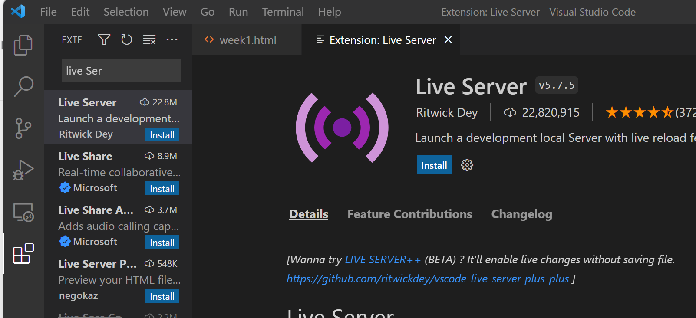
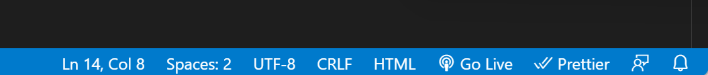
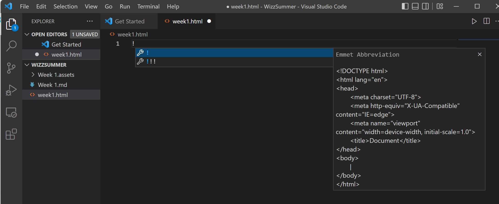
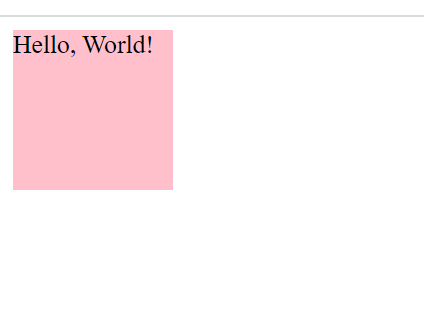
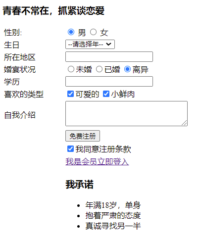

# Week 1 HTML

**tips：想看视频的小伙伴可以b站看一下黑马前端**

## vscode插件安装

由于我个人是使用vscode写前端代码的，在这里我也只推荐vscode了。想用webstorm之类的大家也可以自己去试一下。

### step1 安装vscode

首先要安装个vscode吧，这么好用的IDE不会有人没装吧）

### step2 安装Live Server插件

在插件页面直接搜索Live Server，第一个就是啦



安装完成后会在右下角显示Go live字样（记得要以打开html所在的文件夹）



### step3 实践一把

新建一个html页面，输入!或html5(取决vscode版本)并回车看看会发生什么？没错，一个html的基本框架出现了！



在body里面输入一点东西。

```html
<!DOCTYPE html>
<html lang="en">
<head>
  <meta charset="UTF-8">
  <meta http-equiv="X-UA-Compatible" content="IE=edge">
  <meta name="viewport" content="width=device-width, initial-scale=1.0">
  <title>Document</title>
</head>
<body>
    Hello, World
</body>
</html>
```

点击Go live就可以看到页面啦。


## 认识html标签

从这一小节，我们一起来认识一下html的基本标签  

html的标签大多都是成双成对的，例如

```html
<head></head>
<title></title>
<div></div>
```

下面介绍一些常用标签

### 格式标签

| 标签名            | 定义         | 说明                                         |
| ----------------- | ------------ | -------------------------------------------- |
| <html></html>     | HTML标签     | 页面中最大的标签（根标签）                   |
| <head></head>     | 文档的头部   | head标签中必须设置title标签                  |
| <title></title>   | 文档的标题   | 网页标题                                     |
| <body></body>     | 文档的主体   | 页面内容                                     |
| <!DOCTYPE>        | 文档类型声明 | 写在开头，浏览器使用哪种HTML版本，不属于html |
| <html lang="">    | 语言种类     | en为英语，zh-CN中文                          |
| <meta charset=""> | 字符集       | 常用UTF-8                                    |

### 常用标签

| 标签名                     | 定义     | 说明                                   |
| -------------------------- | -------- | -------------------------------------- |
| <h1> -<h6>(重要)           | 标题标签 | 作为标题使用，标志重要性，单词head缩写 |
| <p></p>                    | 段落标签 | paragraph缩写                          |
| \<br />                    | 换行标签 | 强制换行                               |
| <strong></strong>或<b></b> | 加粗     | <strong>更强烈                         |
| <em></em>或<i></i>         | 倾斜     | <em>更强烈                             |
| <del></del>或<s></s>       | 删除线   | <del>更强烈                            |
| <ins></ins>或<u></u>       | 下划线   | <ins>更强烈                            |
| <div>                      | box      | 独占一行， big box， division          |
| <span>                     | box      | 多个box可在一行显示，small box， span  |

给个栗子：

```html
<!DOCTYPE html>
<html lang="en">
<head>
  <meta charset="UTF-8">
  <meta http-equiv="X-UA-Compatible" content="IE=edge">
  <meta name="viewport" content="width=device-width, initial-scale=1.0">
  <title>Document</title>
</head>
<body>
    <h1>Hello, World</h1>
    <p>Hello, World</p>

    <div>
      <p>first paragraph</p>
      <del><p>second paragraph</p></del>
    </div>
    
    <div>
      <span>box1</span>
      <span>box2</span>
    </div>
</body>
</html>
```

这里用css展示下盒子到底是什么

```html
<!DOCTYPE html>
<html lang="en">
<head>
  <meta charset="UTF-8">
  <meta http-equiv="X-UA-Compatible" content="IE=edge">
  <meta name="viewport" content="width=device-width, initial-scale=1.0">
  <title>Document</title>
</head>
<body>
  <div>
  </div>
  
</body>
<style>
  div {
    height: 100px;
    width: 100px;
    background-color: pink;
  }
</style>
</html>
```



可以看到，顾名思义盒子就是盒子）

### 图像标签 


tips：属性间要有空格，各属性间无顺序

| 属性   | 属性值   | 说明                                 |
| ------ | -------- | ------------------------------------ |
| src    | 图片路径 | src指定图片的地址                    |
| alt    | 文本     | 图像无法显示时，显示该文本           |
| title  | 文本     | 提示文本，将鼠标放在图片上显示的文本 |
| width  | 像素     | 设置宽度                             |
| height | 像素     | 设置高度                             |
| border | 像素     | 设置图像的边框粗细                   |

### 相对路径

| 分类     | 符号 | 说明                         |
| -------- | ---- | ---------------------------- |
| 同级路径 | ./   |                              |
| 下级路径 | /    | 文件位于相对于html文件的下级 |
| 上级路径 | ../  | 文件位于相对于html文件的上级 |

### id标识

给标签一个标识字，方便其它操作寻找or关联

```html
<div id="qwq"></div>
```

### 超链接标签

语法格式： `<a href = "跳转目标" target = "弹出方式">`文字`</a>`

空链接：`<a href = "#">``</a>`

链接内容任意，如果是网页元素则会打开，文件将会下载

锚点链接：点击链接时，快速定位页面某个位置

​	1：`<a href="#名字"></a>`

​	2：在目标位置标签添加id属性 = 名字 `<h3 id = "名字">`


| 属性   | 作用                                                         |
| ------ | ------------------------------------------------------------ |
| href   | 指定连接目标的URL                                            |
| target | 指定打开方式，其中**_self**为默认值，**_blank**为在新窗口内打开 |

### 注释标签

语法格式：`<!--注释语句-->`  快捷键 ctrl + /

### 表格标签

基本语法

```
<table>
	<tr>
		<td>单元格文字</td>
		....
	</tr>
</table>
```

\<table>定义表格  \<tr>定义行  \<td>定义单元格

\<th>表头标签，加粗居中，table head缩写

\<thead>表格头部区域  \<tbody>表格主体部分，两者包含在\<table>之中

| 属性名      | 属性值              | 描述                        |
| ----------- | ------------------- | --------------------------- |
| align       | left, center, right | 对齐方式                    |
| border      | 1 或 ""             | 是否有边框                  |
| cellpadding | 像素值              | 单元边沿与其内容间的空白    |
| cellspacing | 像素值              | 单元格之间的空白，默认2像素 |
| width       | 像素值或百分比      | 表格宽度                    |

#### 合并单元格

跨行合并：rowspan = "合并单元格个数"，最上侧作为目标单元格

跨列合并：colspan = "合并单元格个数"，最左侧作为目标单元格


## Emmet语法介绍

相信大家都有所体会，要重复写好多好多<p></p>标签，那么有没有什么快捷施法呢？

输入emmet语法后按tab，vscode某个版本后好像默认关闭了，可以百度查下咋搞）

```html
p*3   生成3个p标签
div+p*2 生成1个div和2个p，且三者是并列关系
div>p*2 即
<div>
   <p></p>
    <p></p>
</div>

#name
<div id="name"></div>
.name
<div class="name"></div>
```


## 亿些标签及属性

标签的属性虽然有很多，**其实用到的最多的就是div，input什么的，大家略微看看就好，需要的时候去百度**，样式调整相关我们将会在后续的css章节中学习

### 列表标签

#### 无序列表

基本语法

```html
<ul>
	<li></li>
	<li></li>
</ul>
```

\<ul>中只能嵌套\<li>, \<li>可以放任意

list-style可去掉小圆点

#### 有序列表

```html
<ol>
	<li></li>
    <li></li>
</ol>
```

#### 自定义列表

```html
<dl>
    <dt>名词1</dt>
    <dd></dd>
    <dd></dd>
</dl>
```

### 表单标签

```
<form acton="url地址" method="提交方式" name="表单域名称">
	各种表单元素控件
</form>
```

| 属性   | 属性值   | 作用                                    |
| ------ | -------- | --------------------------------------- |
| action | url地址  | 指定接受并处理表单数据的服务器的url地址 |
| method | get/post | 设置表单提交方式                        |
| name   | 名称     | 表单名称                                |

### input 表单控件

```
<input type="">
```

| 属性值   | 描述                                   |
| -------- | -------------------------------------- |
| button   | 定义可点击按钮                         |
| checkbox | 定义复选框                             |
| file     | 定义输入字段和浏览按钮，供文件上传     |
| hidden   | 定义隐藏的输入字段                     |
| image    | 定义图像形式的提交按钮                 |
| password | 定义密码字段（被掩码）                 |
| radio    | 定义单选按钮，相同name可实现多选一     |
| reset    | 定义重置按钮                           |
| submit   | 定义提交按钮，会将表单数据发送到服务器 |
| text     | 定义单行输入字段                       |

| 属性      | 属性值  | 描述                              |
| --------- | ------- | --------------------------------- |
| name      |         | 定义input元素的名称               |
| value     |         | 定义input元素的值                 |
| checked   | checked | 规定此input元素首次加载时会被选中 |
| maxlength | 正整数  | 规定输入字段中的字符的最大长度    |

### lable标签

lable标签绑定表单元素，增加用户体验

基本语法

```html
<lable for="what">用户名</lable>  <!-- 点击用户名时，光标定位至input -->
<input type="text" id="what">
```

### select标签(下拉表单)

基本语法

```html
<select>
    <option selected = "selected"></option>	<!-- 默认选中 -->
    <option></option>
</select>
```

### textarea（适用于较多输入

基本语法

```html
<textarea cols="一行字数" rows="行数">
    
</textarea>
```


## HTML5

标签具体有很多很多，这里只是单纯陈列了一些，大家需要的时候可以手动百度

```html
<header></header>头部标签
<nav></nav>导航标签
<article></article>内容标签
<section></section>定义文档某个区域
<aside></aside>侧边栏标签
<footer></footer>底部标签
```

Tips:  IE9要转换为跨级元素

### video

```html
<vidio>视频
最好用MP4格式
<video src="文件地址" controls="controls">
    
</video>
```

| Symbol   | Value     | Description                          |
| -------- | --------- | ------------------------------------ |
| autoplay | autoplay  | 自动播放（Google需添加muted）        |
| controls | controls  | 向用户显示播放控件                   |
| width    | px        | 设置宽度                             |
| height   | px        | 设置高度                             |
| loop     | loop      | 是否循环播放                         |
| preload  | auto/none | 是否预加载，若有autoplay则忽略该属性 |
| src      | url       | 视频地址                             |
| poster   | imgurl    | 加载等待的画面图片                   |
| muted    | muted     | 静音播放                             |

### audio

```html
<audio src="文件地址" controls="controls">
    
</audio>
```

### input type=""

| Symbol | Description          |
| ------ | -------------------- |
| email  | 输入必须为Email类型  |
| url    | url                  |
| date   | 日期                 |
| time   | 时间                 |
| month  | 月                   |
| week   | 周                   |
| number | 数字                 |
| tel    | 手机号码             |
| search | 搜索框               |
| color  | 生成一个颜色选择表单 |

### 表单属性

| Symbol          | Value     | Description                                                  |
| --------------- | --------- | ------------------------------------------------------------ |
| required        | required  | 表示内容不能为空，必填                                       |
| **placegolder** | 提示文本  | 表单的提示信息,存在默认值将不显示                            |
| autofocus       | autofocus | 自动聚焦属性，页面加载完成自动聚焦指定表单                   |
| autocomplete    | off/on    | 在用户在字段开始键入时，浏览器基于之前键入过的值，应该显示出在字段中填写的选项。必须要有name属性，且提交过 |
| **multiple**    | multiple  | 可以多选文件提交                                             |


## 本周练习

**提交方式**： 邮箱 lxy.littlechai@qq.com or 私发给我

1、用网页写出一篇新闻（新闻内容即可）https://www.chinanews.com.cn/sh/2022/06-25/9788490.shtml

2、写一下以下页面


