# Week4 

这周分享一下写页面的一些小知识，一起写一下b站首页的一些部分


## 项目结构

好的结构才能让写代码更加快捷方便，在使用三件套（html，css，js）写页面时，我们应有怎样的项目结构呢？

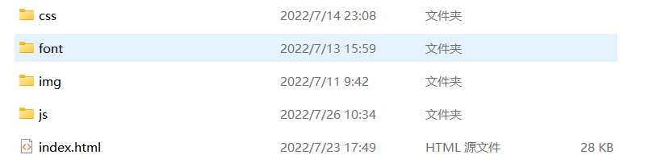

我们可以简单的分为css（存放css样式代码），font（存放字体相关），img（存放图片），js（存放js代码，当然现在用不到）

## 页面初始化

所谓页面初始化，就是指清除浏览器默认css样式，这里给出一段简单的初始化代码，网上有很多很多，大家也可以直接copy一下

默认名为`common.css`，全局公共样式也可以写在这里。

```css
*{margin:0;padding:0;}

li{list-style:none}

img{vertical-align:top;border:none}

input {
  outline: none;
}
```

并引入到`index.html`里

```html
<link rel="stylesheet" href="css/common.css">
```


## 字体引用

经过前几周的作业，小伙伴们肯定发现，我们自己的字体好丑啊，怎样使用b站的字体呢？

经百度，b站使用的是华为鸿蒙字体，[下载地址](http://link.zhihu.com/?target=https%3A//communityfile-drcn.op.hicloud.com/FileServer/getFile/cmtyPub/011/111/111/0000000000011111111.20210901095443.74581760409541900242078305341701%3A50520831022654%3A2800%3A9F02B57E1BD25D06595FC0F53E736B7654496543DCA355D0A7640A3230FFAA90.zip%3FneedInitFileName%3Dtrue)

下载这个文件，将内容放在`font`文件夹下，如图所示

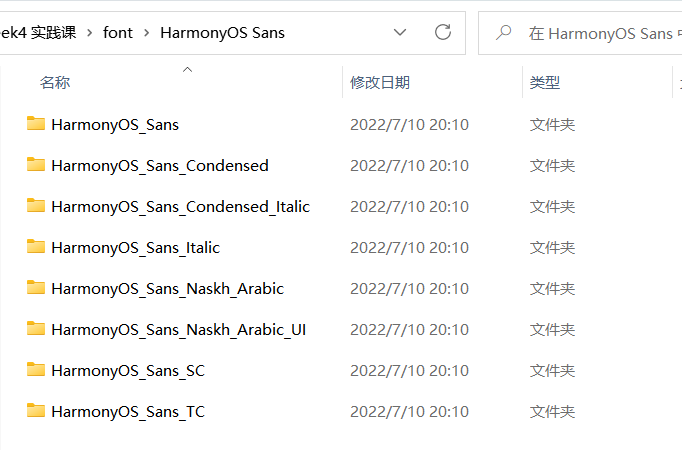

那怎样使用呢？之前学过`font-family`可以声明使用的字体，那我们只需要将下载的字体 引入，再声明就ok了

可以使用`@font-face`来引用字体，并将其命名为`bilibili-font`

**注意：**路径要根据自己的设置，要导入**HarmonyOS_Sans_SC**下的**ttf**文件

```css
@font-face {
  font-style: normal;
  font-family: 'bilibili-font';
  src: url("../font/HarmonyOS Sans/HarmonyOS_Sans_SC/HarmonyOS_Sans_SC_Regular.ttf")  format('truetype');
  
}
```

当然这是一个全局样式，我们也在全局使用这中字体，所以我们可以在`common.css`里添加这段代码，并全局声明`font-family`

```css
@font-face {
  font-style: normal;
  font-family: 'bilibili-font';
  src: url("../font/HarmonyOS Sans/HarmonyOS_Sans_SC/HarmonyOS_Sans_SC_Regular.ttf")  format('truetype');
  
}

*{margin:0;padding:0;font-family: 'bilibili-font';}

li{list-style:none}

img{vertical-align:top;border:none}

input {
  outline: none;
}

```


## 页面布局

之前我们已经学过基本布局（直接使用px写死），flex布局 （超好用是不是）

下面简单说一下流式布局（百分比布局）、less+rem+媒体查询布局

### 流式布局

流式布局就是宽高单位采用百分比的形式，或vw、vh等，这样可以使页面元素随着浏览器界面大小收缩

```css
.example {
    width: 50%;
    height: 100px;
}
```

### less+rem+媒体查询布局

#### less

less是css的预处理器，语法非常好用，这里给个例子就不展开了，大家有兴趣自己学习一下

```html
<div class="A">
    <div class="B">
        
    </div>
</div>

css写法
<style lang="css">
.A .B {

}
</style>
less写法
<style lang="less">
.A {
	.B {
		支持嵌套等等语法，是不是非常方便呢？
	}
}
</style>
```

#### 媒体查询

简单来说媒体查询支持了根据浏览器窗口的大小，提供n套不同的css样式，来 适配屏幕，显得更加美观，不过这工作量好大好大，我没用过，大家有兴趣自己学习一下（狗头保命） 


现在我们完成了基本的准备，大家可以选择自己喜欢的布局模式，当然我是混着用的，写的也比较搓，下面开始写页面啦

by the way， **关于代码规范**，大家写代码还是要**多用英文单词啊，别整 简写或者拼音**，记得使用**驼峰命名法**，或者用`-`

## navigation导航栏

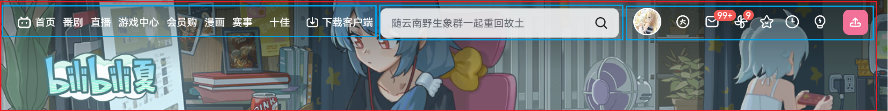

我们可以大体将navigation分为四个div，其中`left-aside`和`right-aisde`内部使用`flex`布局

但小logo怎么用呢，这里向大家介绍一下`iconfont`

### 关于iconfont

[阿里巴巴矢量图库](https://www.iconfont.cn/)

#### 新建项目

可以在我的项目中创建新的项目

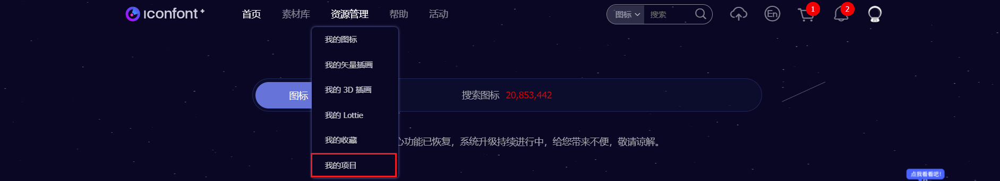

#### 添加图标

在搜索框中搜索图标

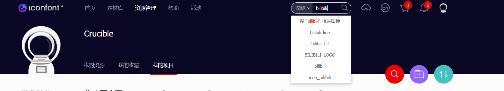

添加入库

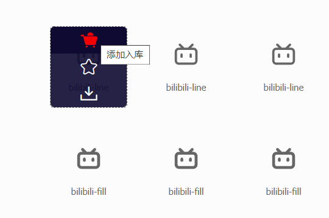

点击右上方购物车


添加至项目

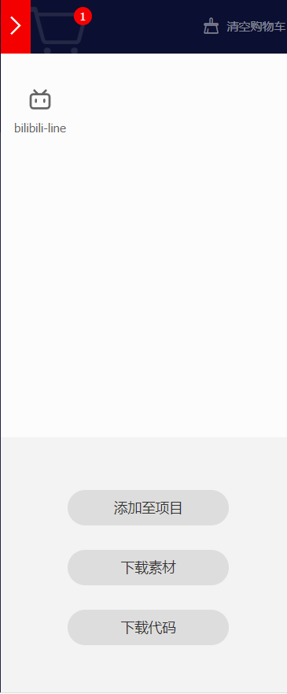

#### 引入图标

这里有三种方式引入Unicode、Font class、Symbol，这里只介绍比较清晰的Font class

点击下载到本地按钮

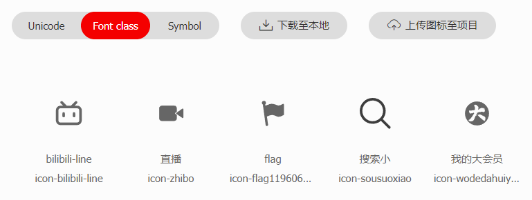

将下载完成的文件解压到`font`文件夹下 

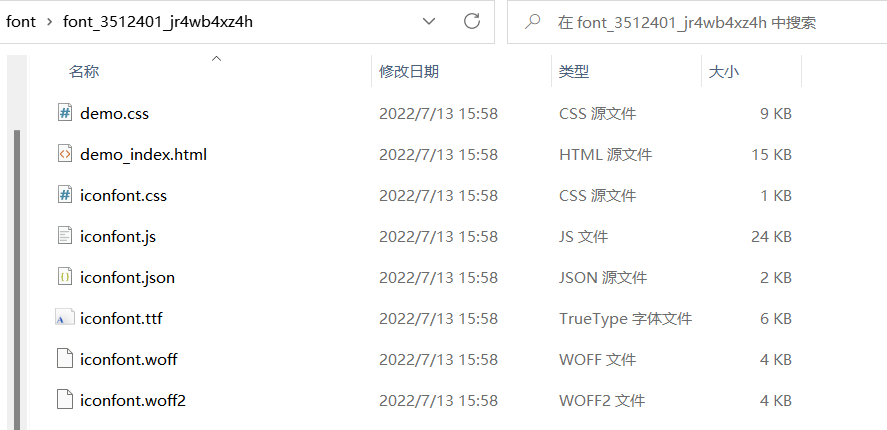

其中`demo_index.html`是介绍怎样使用的文件，有兴趣可以详细看下

这里我们只需要将`iconfont.css`文件引入`index.html`中，并在需要插入的地方给出对应的`class`就ok了

```html
<link rel="stylesheet" href="font/font_3512401_jr4wb4xz4h/iconfont.css">
```

如要添加**大会员**这个图标，在我的项目界面，将鼠标放在大会员上，点击复制代码

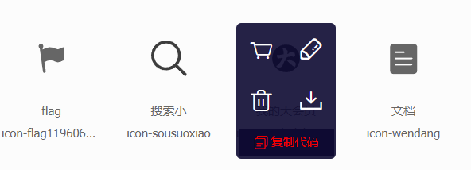

像这样给`class`添加`iconfont和 对应图标class`就可以使用了

```html
<div class="item iconfont icon-wodedahuiyuan">大会员</div>
```

唉，等等，这图标颜色不太对啊，怎样调整图标颜色呢？

- 在我的项目里点击编辑（铅笔logo）修改，不过修改后需要重新下载
- 使用class修改，字体图标也是字嘛，直接使用`color`属性修改就好啦


### 参考代码

这里我偷懒了，直接复制了svg代码，所以**删除了比较冗长的部分**，详见github吧，大家在 写的时候可以按照上述方式添加图标。

当然如果你也想偷懒的话。。。

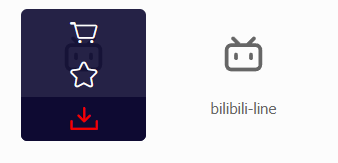

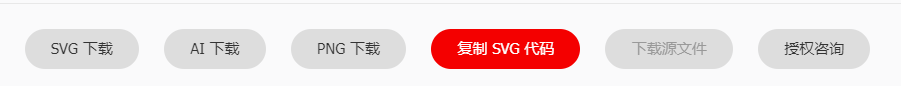


```html
<link rel="stylesheet" href="css/nav.css">
<div class="banner">
    
    <nav class="nav">
      <div class="left-aside">
        <svg t="1657453695714" class="icon" viewBox="0 0 1024 1024" version="1.1" xmlns="http://www.w3.org/2000/svg" p-id="5050" width="200" height="200"><path></path></svg>
        <div>首页</div>
        <div>番剧</div>
        <div>直播</div>
        <div>游戏中心</div>
        <div>会员购</div>
        <div>漫画</div>
        <div>赛事</div>
      </div>

      <div class="search-container">
        <div class="search">
          <input type="text" placeholder="来自初代奥特曼的56周年问候!">
          <svg t="1657466795417" class="icon icon-search" viewBox="0 0 1024 1024" version="1.1" xmlns="http://www.w3.org/2000/svg" p-id="1844" width="200" height="200"><path ></path></svg>
        </div>
        <div class="hot-search">
          <h3>热搜</h3>
          <div class="item">1 &nbsp 周星驰最伟大的作品</div>
          <div class="item">2 &nbsp V5战胜EDG</div>
          <div class="item">3 &nbsp 明日方舟</div>
        </div>
      </div>
      

      <div class="right-aside">
        </img>
        <div><svg t="1657501965964" class="icon" viewBox="0 0 1024 1024" version="1.1" xmlns="http://www.w3.org/2000/svg" p-id="2720" width="200" height="200"><path></path></svg></div>
        <div><svg></path><path d="M873.9 526.6H512.4c-8.3 0-15-6.7-15-15s6.7-15 15-15h361.4c8.3 0 15 6.7 15 15 0.1 8.2-6.7 15-14.9 15z" p-id="5309" fill="#ffffff"></path></svg></div>
        <div><svg t="1657502151942" class="icon" viewBox="0 0 1024 1024" version="1.1" xmlns="http://www.w3.org/2000/svg" p-id="7079" width="200" height="200"><path></path></svg></div>
        <div class="upload"><svg t="1657502514239" class="icon" viewBox="0 0 1024 1024" version="1.1" xmlns="http://www.w3.org/2000/svg" p-id="9177" width="200" height="200"><path></path></svg></div>
      </div>
    </nav>
  </div>
```

```css
.banner {
  position: relative;
  height: 250px;
  width: 100%;
  background-image: url("../img/banner.webp");
  background-size: 125% 100%;
  background-position: center;
  background-repeat: no-repeat;

}

/* logo */
.banner .bilibili-logo {
  position: absolute;
  top: 130px;
  left: 100px;
  height: 100px;
  width: 200px;
}

.banner .nav {
  display: flex;
  align-items: center;
  height: 100px;
  width: 100%;
  
}
@keyframes jump{
  50% {
    transform: translateY(-5px);
  }
  0%, 100% {
    transform: translate(0,0);
  }
}
/* left aside */

.banner .nav .left-aside {
  position: relative;
  float: left;
  display: flex;
  align-items: center;
  height: 50px;
  width: 500px;
  color: #ffffff;
  font-weight: 500;
  font-size: 22px;
  text-align: center;
  margin-left: 80px;


}
.banner .nav .left-aside .icon {
 
  height: 30px;
  width: 50px;
}
.banner .nav .left-aside div {
  
  display: inline-block;
  margin: 0 5px;
  
}
.banner .nav .left-aside div:hover {
  animation: jump 0.3s;
}

/* search input */
.banner .search-container {
  width: 600px;
  padding-left: 100px;
}
.banner .search {
  box-sizing: border-box;
  display: flex;
  align-items: center;
  width: 600px;
  height: 50px;
  background-color: rgba(255, 255, 255, 0.8);
  padding: 6px;
  border-radius: 10px;
}
.banner .search:hover {
  background-color: rgba(255, 255, 255, 0.9);
}
.banner .search input {
  
  width: 530px;
  height: 50px;
  border: none;
  border-radius: 10px;
  background-color: rgba(255, 255, 255, 0);
  padding-left: 20px;
  font-size: 18px;

  color: black;

}
.banner .search input:focus {
  background-color: rgba(139, 138, 138, 0.2);
  
}

.banner .search .icon-search {
  float: right;
  height: 30px;
  width: 30px;
  
}

/* 这里学了js再搞。。。 */
.banner .hot-search {
  display: none;
  width: 600px;
  background-color: #ffffff;
  border-radius: 10px;
  transform: translateY(-13px);
  padding: 10px 0;
  
}

.banner .hot-search h3+.item {
  box-sizing: border-box;
  height: 30px;
  width: 100%;
  background-color: #ffffff;
  padding-left: 20px;
  margin: 10px 0;
  
}
.banner .hot-search h3 {
  height: 30px;
  font-size: 25px;
  font-weight: normal;
}
.banner .hot-search .item {
  height: 30px;
  font-size: 22px;
  padding-left: 30px;
}

/* right side */
.banner .right-aside {
  float: right;
  display: flex;
  align-items: center;
  width: 500px;
}
.banner .right-aside div {
  display: inline-block;
  height: 35px;
  width: 35px;
  margin: 0 15px;

}
.banner .right-aside div:hover {
  animation: jump .3s;
}
.banner .right-aside svg {
  height: 35px;
  width: 35px;
}
.banner .right-aside .avatar {
  display: inline-block;
  height: 50px;
  width: 50px;
  border: 2px solid #ffffff;
  border-radius: 100%;
  margin: 0 15px 0 30px;
}
.banner .right-aside .upload {
  display: inline-flex;
  align-items: center;
  background-color: #f27199;
  border-radius: 5px;
}

```


## channel频道

channel也很简单啦，就是一个大盒子，里面三个小盒子，都采用flex布局，这里需要注意的一个地方是**版心**

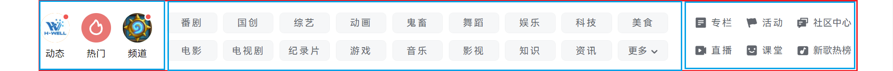

### 关于版心

什么是版心 ？我们可以观察到，页面的两边都是由留白的

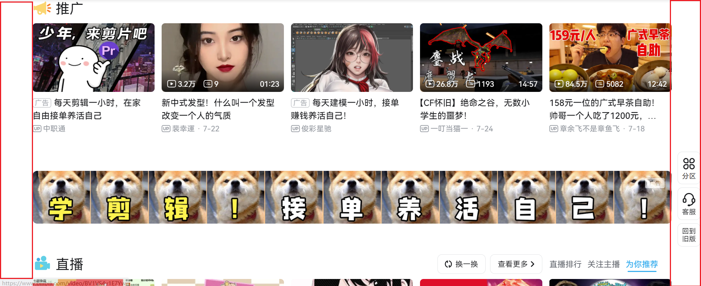

我们中间盒子的位置就称之为版心，这段公共样式可放在`common.css`里

```css
/* 版心 */
.w {
  width: 90%;
  margin: 0 auto;
  
}
```

### 参考代码

```html
<!-- channel -->
  <div class="w channel">
    <div class="left-aside">
      <div class="box">
        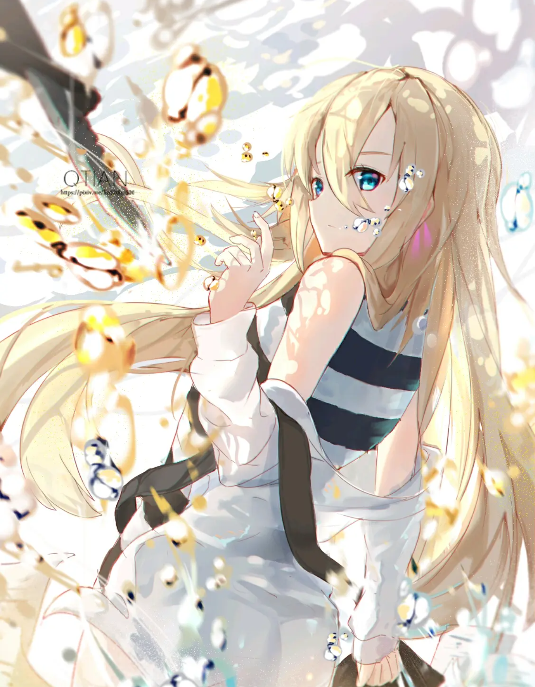
        <div class="title">动态</div>
      </div>
      <div class="box">
        
        <div class="title">热门</div>
      </div>
      <div class="box">
        
        <div class="title">频道</div>
      </div>
    </div>
    <div class="mid-aside">
      <div class="item">番剧</div>
      <div class="item">番剧</div>
      <div class="item">番剧</div>
      <div class="item">番剧</div>
      <div class="item">番剧</div>
      <div class="item">番剧</div>
      <div class="item">番剧</div>
      <div class="item">番剧</div>
      <div class="item">番剧</div>
      <div class="item">番剧</div>
      <div class="item">番剧</div>
      <div class="item">番剧</div>
      <div class="item">番剧</div>
      <div class="item">番剧</div>
      <div class="item">番剧</div>
      <div class="item">番剧</div>
      <div class="item">番剧</div>
      <div class="item">番剧</div>
    </div>
    <div class="right-aside">
        <div class="item iconfont icon-wendang">专栏</div>
        <div class="item icon-flag1196069easyiconnet iconfont">活动</div>
        <div class="item iconfont icon-hudongjiaoliu">社区中心</div>
        <div class="item iconfont icon-zhibo">直播</div>
        <div class="item iconfont icon-jingpinketang" >课堂</div>
        <div class="item iconfont icon-yinle">新歌热榜</div>

    </div>
  </div>
```

channel.css

```css
.channel {
  display: flex;
  align-items: center;
  height: 120px;
  padding: 20px 0;
}


/* left aside */
.channel .left-aside {
  display: flex;
  justify-content: space-around;
  width: 20%;
  text-align: center;
}

.channel .left-aside img{
  height: 70px;
  width: 70px;
  border-radius: 100%;
}

.channel .left-aside .title {
  font-size: 21px;
}

/* middle aside */
.channel .mid-aside {
  display: flex;
  flex-wrap: wrap;
  justify-content: space-around;
  align-items: center;
  width: 55%;
  height: 90%;
  padding: 0 20px;

  
}
.channel .mid-aside .item {
  display: flex;
  justify-content: center;
  align-items: center;
 
  height: 40px;
  width: 10%;
  /* split in average */
  margin-left: 0.5%;
  letter-spacing: 5px;
  font-size: 20px;
  border-radius: 5px;
  background-color: rgba(245, 246, 247, 0.8);
  transition: all .5s;
}

.channel .mid-aside .item:hover {
  background-color: rgb(223, 225, 227);
}

/* right aside */
.channel .right-aside {
  display: flex;
  flex-wrap: wrap;
  justify-content: space-around;
  width: 23%;
  border-left: 1px solid rgb(227, 229, 231);
}
.channel .right-aside>div {
  display: flex;
  align-items: center;
  justify-content: center;
  width: 33%;
  height: 50px;
  
}
.channel .right-aside .hover {
  display: none;
}
.channel .right-aside .item::before {
  font-size: 25px;
  margin-right: 2px;
  /* important */
  vertical-align: sub;

}
.channel .right-aside .item {
  font-weight: 500;
  transition: all .5s;
  font-size: 19px;
  letter-spacing: 5px;
  color: #62666d;
}
.channel .right-aside .item:hover {
  color: #3caeec;
}
```


## Favicon

Favicon就是小图标啦

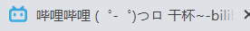

怎样引入呢？

百度搜索favicon，会找到图标生成器，生成ico文件后，引入到html中

```html
<link rel="icon" type="image/png" sizes="16x16" href="/favicon-16x16.ico">
```


## 简易的SEO优化，虽然没什么用

### title

suggestion：网站名（产品名）- 网站的介绍（尽量不超过30字）

### description

总体业务及主题概括，多采用“我们是...“、我们提供、×××网作为。

电话：之类

### keywords

最好6~8关键词，用英文逗号隔开


一个栗子

```html
<html lang="en">
<head>
    <meta charset="UTF-8">
    <meta http-equiv="X-UA-Compatible" content="IE=edge">
    <meta name="viewport" content="width=device-width, initial-scale=1.0">
    <title>品优购商城-综合网购首选-正品低价、品质保障、配送及时、轻松购物!</title>
    <meta name="description" content="品优购商城-专业的网上购物商城">
    <meta name="keywords" content="网上购物、网上商城">

</head>
```


## LOGO SEO优化

1. logo里面首先放一个**h1**标签，目的是为了提权，告诉搜索引擎important
2. h1里面再放一个**链接**，可以返回首页的，把logo的背景图片给链接即可
3. 为了搜索引擎收录我们，在链接里放文字（网站名称），但文字不要显示

 - 方法1： text-indent一道盒子外面（text-indent:-9999px）,然后overflow:hidden
 - 方法2：直接给font-size:0;

4. 最够给链接放一个**title**属性，这样鼠标放到logo上就可以看到提示文字了


## 练习

**提交方式**： 邮箱 lxy.littlechai@qq.com or 私发给我

**1、**根据本周内容完成b站的navigation和channel栏

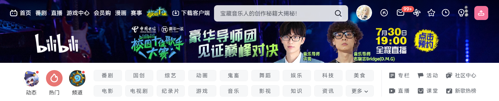

**2、（选做）**自主完成b站的剩余部分
